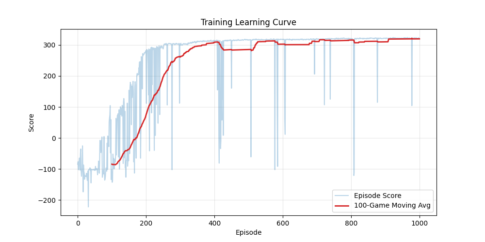
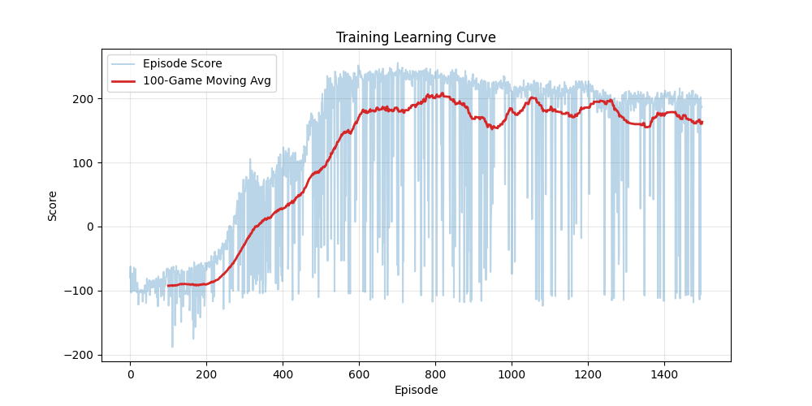

# Continuous Control Workbench (PyTorch) 🤖

<p align="center">
  
  
  
</p>

A research-grade, **from-scratch implementation** of state-of-the-art Deep Reinforcement Learning algorithms for continuous control.

This repository is structured to demonstrate mastery over **advanced continuous action spaces**, intentionally bypassing high-level wrappers (like SB3) to implement critical exploration mechanisms directly in PyTorch. It serves as a workbench for benchmarking **Off-Policy** (TD3, SAC) vs. **On-Policy** (PPO) agents on complex physics environments like `BipedalWalker-v3`.


---

## 🎥 Results & Performance

<p align="center">
  <br>
  <em>Trained SAC agent navigating complex terrain.</em>
</p>

<p align="center">
  
  
</p>

<p align="center">
  <em>Comparative training process: SAC (Fast convergence) vs. PPO.</em>
</p>

---

## 🧠 Algorithm Landscape

This workbench implements three modern continuous RL controlers. Each algorithm offers a different trade-off between sample efficiency and stability:

| Algorithm | Type | Sample Efficiency | Stability | 
| :--- | :--- | :--- | :--- | 
| **SAC** (Soft Actor-Critic) | Off-Policy | ⭐⭐⭐⭐⭐ (High) | ⭐⭐⭐⭐ |
| **TD3** (Twin Delayed DDPG) | Off-Policy | ⭐⭐⭐⭐ (High) | ⭐⭐⭐ |
| **PPO** (Proximal Policy Opt) | On-Policy | ⭐⭐ (Low) | ⭐⭐⭐⭐⭐ |

---

## ✨ Key Features

This is not just a script collection; it is a structured framework with advanced RL components:

* **Modular Design:** Each algorithm is self-contained with its own `Agent`, `Buffer`, and `Network` classes for easy isolation and testing.
* **TD3 Specifics:**
    * **Target Policy Smoothing:** Adds noise to target actions to prevent overfitting to sharp Q-value peaks.
    * **Delayed Updates:** Updates the Actor network less frequently than the Critic to stabilize learning.
* **SAC Specifics:**
    * **Automatic Entropy Tuning:** Dynamically adjusts the temperature ($\alpha$) to balance exploration vs. exploitation automatically.
    * **Reparameterization Trick:** Allows backpropagation through the stochastic sampling process.
* **PPO Specifics:**
    * **GAE (Generalized Advantage Estimation):** Balances bias and variance in reward estimation.
    * **Normalization Wrappers:** Use of Gymnasium wrappers to normalize observations and rewards for stable gradients.

---

## 📦 Environment Setup

Use the provided Conda environment to ensure GPU support and correct Gymnasium versions.

```bash
# 1. Clone the repository
git clone [https://github.com/Tahernezhad/continuous-control-workbench.git](https://github.com/Tahernezhad/continuous-control-workbench.git)
cd continuous-control-workbench

# 2. Create the environment
conda env create -f environment.yml

# 3. Activate
conda activate rl
```

---

## 🗂️ Project Structure

```text
continuous-control-workbench/
├── PPO/                        # Proximal Policy Optimization
│   ├── ppo_agent.py            # Clip loss & GAE logic
│   ├── replay.py               # Load a run and visualize the policy
│   ├── rollout_buffer.py       # On-policy batch storage (cleared every update)
│   ├── networks.py             # Gaussian Actor (Continuous)
│   ├── utils.py                # Logging, seeding, helpers
│   ├── config.py               # Hyperparameters
│   └── main.py                 # Training loop
├── SAC/                        # Soft Actor-Critic
│   ├── sac_agent.py            # Automatic Alpha Tuning logic
│   ├── networks.py             # Twin Critics & Squashed Gaussian Actor
│   ├── config.py               # Hyperparameters
│   ├── replay_buffer.py        # Off-policy storage (persistent)
│   ├── utils.py                # Logging, seeding, helpers
│   ├── replay.py               # Load a run and visualize the policy
│   └── main.py                 # Training loop
├── TD3/                        # Twin Delayed DDPG
│   ├── td3_agent.py            # Target smoothing & delayed updates
│   ├── config.py               # Hyperparameters
│   ├── networks.py             # Deterministic Actor
│   ├── replay_buffer.py        # Off-policy storage (persistent)
│   ├── replay.py               # Load a run and visualize the policy
│   ├── utils.py                # Logging, seeding, helpers
│   └── main.py                 # Training loop
└── environment.yml             # Reproducible Conda environment
```

---

## 🚀 Usage

### 1. Training an Agent
Navigate to the specific algorithm folder and run `main.py`. Artifacts are saved to a timestamped `results/` folder.

```bash
cd SAC
python main.py
```

### 2. Replaying a Trained Model
To visualize a trained agent, run the replay script. You may need to edit the `RESULTS_PATH` inside the script to point to your specific run.

```bash
cd SAC
python replay.py
```

---

## 🔮 Future Roadmap

- [ ] **Hindsight Experience Replay (HER):** Implement HER for sparse-reward robotics tasks (e.g., FetchReach).
- [ ] **Benchmarking Script:** A unified script to run all three algorithms and auto-generate comparison plots.

---

## 🙌 Acknowledgements

- Gymnasium for the environments.
- PyTorch for the deep learning framework.